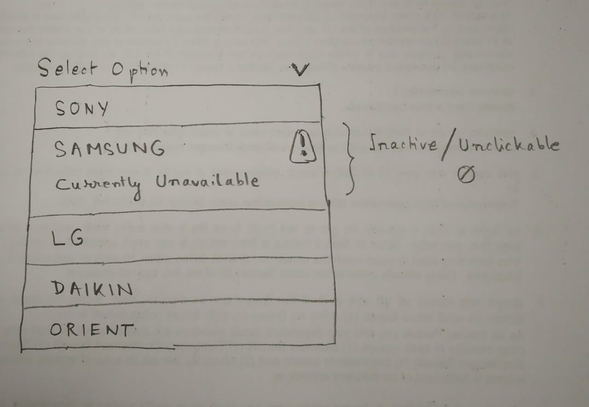

# README #

Advanced Custom Components

### Accordion ###

* A custom Accordion having props to customize it.
* The props noTopBorder and notLastItem configures the borders.
* customHeader accepts custom created header content. If not supplied, falls back to default layout.

### Dropdown ###

* Can be configured to look like this:

